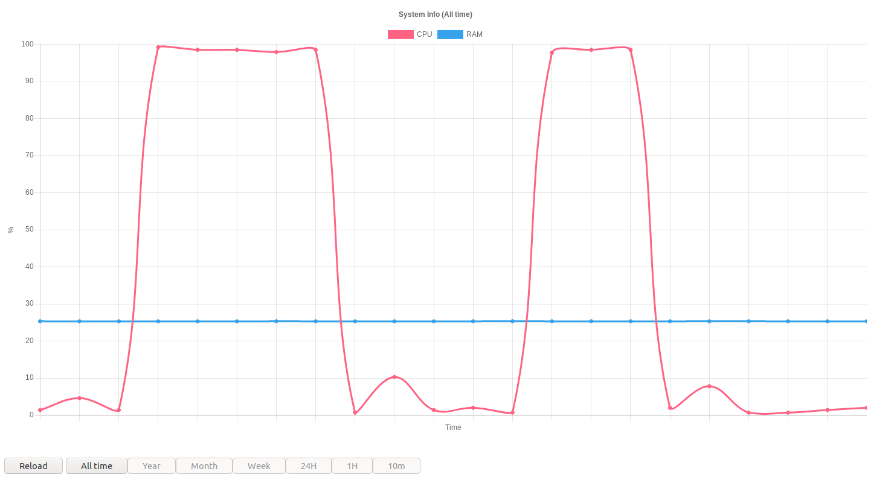

[](https://github.com/boyter/scc/#badges-beta)
[](https://lgtm.com/projects/g/Klemek/simple-csv-reader/context:javascript)
[](https://lgtm.com/projects/g/Klemek/simple-csv-reader/alerts/)

# Simple CSV Reader

A static web page where you can read data from a CSV into a simple graph.
Set-up a cron job to update the CSV file and you're ready to go.

You need to configure the `something_config.js` and update `index.html` file for your case.

**[live example](https://klemek.github.io/Simple-CSV-Reader/)**

## Example: Speed-Test


First, pull this repo into your server:
```
cd /path/to/server/files
mkdir speedtest
git clone https://github.com/klemek/Simple-CSV-Reader speedtest
cd speedtest
```

Then, install the `speedtest-cli` tool

```
sudo apt-get update
sudo apt-get upgrade
sudo apt-get install python-pip
sudo pip install speedtest-cli
```

Write your job script inside the same directory like this (already available in this repo):

`speedtest.sh`
```bash
#!/bin/sh
SCRIPT=`realpath -s $0`
DIR=`dirname ${SCRIPT}`
echo `date` started
/usr/local/bin/speedtest-cli --single --csv >> ${DIR}/speedtest.csv
echo `date` done
```

Then, write a cron job to run every 15 minutes (or the time you want)

```
crontab -e
```
add the line (depending on your path)
```
*/15 * * * * /path/to/speedtest.sh >> /path/to/speedtest.log 2>&1
```

The bash script will adapt itself to the directory it's into.

Your endpoint should be already working (you might need to wait some time for data to be gathered).

You can also check if the cron job is running with the `speedtest.log` file.

Now you need to edit the script config like this (don't forget to change the script reference in the `index.html`):

`speedtest_config.js`
```javascript
// === CONFIG ===

//general
const TIME_STEP = 15; //minutes

//CSV data
const CSV_PATH = './speedtest.csv'; // path accessible by ajax request
const CSV_SIZE = 8; // line max size
const CSV_DATE = 3; // column containing the date
const CSV_COLUMNS = [6, 7, 5];

//Display data
const GRAPH_TITLE = 'Speed-Test';
const COLUMNS_NAME = ['Download', 'Upload', 'Ping'];
const COLUMNS_FACTOR = [1 / 8e6, 1 / 8e6, 1]; // the 2 firsts need to be scaled down
const COLUMNS_PRECISION = [3, 3, 3];
const COLUMNS_SECONDARY = [false, false, true]; // the Ping on the secondary axis
const COLORS = [
  'rgb(255,99,132)',
  'rgb(54, 162, 235)',
  'rgb(255, 159, 64)'
];
const Y_UNIT = 'MBps';
const Y_SECONDARY_UNIT = 'ms';
```

## Example: System info



First, pull this repo into your server:
```
cd /path/to/server/files
mkdir sysinfo
git clone https://github.com/klemek/Simple-CSV-Reader sysinfo
cd sysinfo
```

Write your job script inside the same directory like this (already available in this repo):

`sysinfo.sh`
```bash
#!/bin/bash
export LC_ALL=en_US.utf8
SCRIPT=`realpath -s $0`
DIR=`dirname ${SCRIPT}`

RAWCPU=`top -n 1 -b |grep "Cpu(s)"`
CPU=(${RAWCPU/:/ })
MEM=(`top -n 1 -b |grep "Mem :"`)

MEMUSED=`printf %.3f "$(echo "100000*${MEM[7]}/${MEM[3]}"|bc)e-3"`

echo "`date` / ${CPU[1]} % / $MEMUSED %"
echo "`date -Is`,${CPU[1]},$MEMUSED" >> ${DIR}/sysinfo.csv
```

Then, write a cron job to run every minute (or the time you want)

```
crontab -e
```
add the line (depending on your path)
```
* * * * * /path/to/sysinfo.sh >> /path/to/sysinfo.log 2>&1
```

The bash script will adapt itself to the directory it's into.

Your endpoint should be already working (you might need to wait some time for data to be gathered).

You can also check if the cron job is running with the `sysinfo.log` file.

Now you need to edit the script config like this (don't forget to change the script reference in the `index.html`):

`sysinfo_config.js`
```javascript
// === CONFIG ===

//general
const TIME_STEP = 1; //minutes

//CSV data
const CSV_PATH = './sysinfo.csv'; // path accessible by ajax request
const CSV_SEPARATOR = ',';
const CSV_SIZE = 3; // line max size
const CSV_DATE = 0; // column containing the date
const CSV_COLUMNS = [1, 2];

//Display data
const GRAPH_TITLE = 'System Info';
const COLUMNS_NAME = ['CPU', 'RAM'];
const COLUMNS_FACTOR = [1, 1]; // the 2 firsts need to be scaled down
const COLUMNS_PRECISION = [3, 3];
const COLUMNS_SECONDARY = [false, false]; // the Ping on the secondary axis
const COLORS = [
  'rgb(255,99,132)',
  'rgb(54, 162, 235)'
];
const Y_UNIT = '%';
const Y_SECONDARY_UNIT = '';
```
