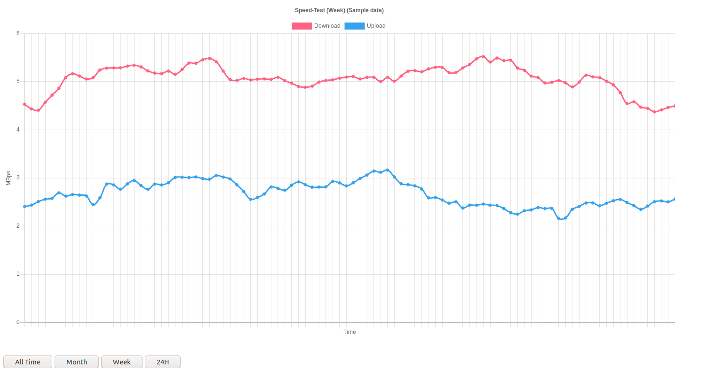

# speedtest-logs



## Installation

First, install the `speedtest-cli` tool

```
sudo apt-get update
sudo apt-get upgrade
sudo apt-get install python-pip
sudo pip install speedtest-cli
```

Then, write a cron job to run every 15 minutes (or the time you want)

> If you choose another time frame, you must edit `script.js` and change the `TIME_STEP` var)

```
crontab -e
```
add the line (depending on your path)
```
*/15 * * * * /path/to/speedtest.sh >> /path/to/speedtest.log 2>&1
```

The bash script will adapt itself to the directory it's into.

Your endpoint should be already working (you might need to wait some time for data to be gathered).

You can also check if the cron job is running with the `speedtest.log` file.
